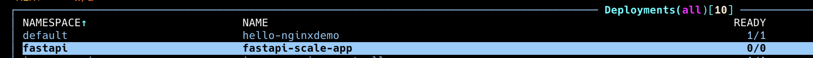
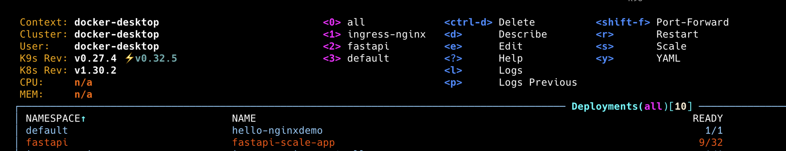
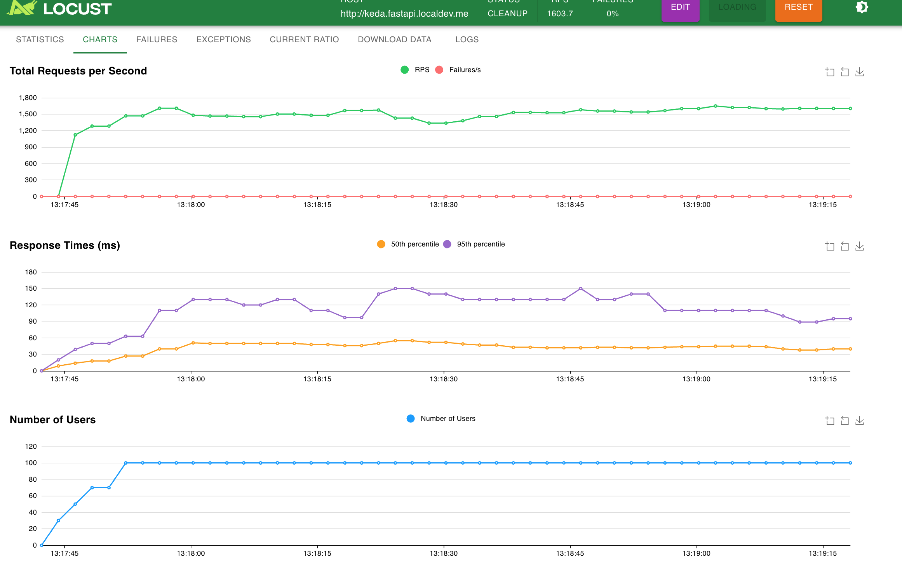

# Get started

- Run local k8s cluster
- Create `fastapi` namespace

  ```bash
  kubectl create namespace fastapi
  ```

- Install NGINX ingress controller
  kubectl apply -f <https://raw.githubusercontent.com/kubernetes/ingress-nginx/controller-v1.6.4/deploy/static/provider/cloud/deploy.yaml>

- Install KEDA

```bash
helm repo add kedacore https://kedacore.github.io/charts
helm install keda kedacore/keda --namespace keda --create-namespace

helm install http-add-on kedacore/keda-add-ons-http --namespace keda --create-namespace
```

- Build the image `make build`
- Apply k8s resource

  ```bash
  kubectl apply -f kubernetes/manifests/
  ```

- Access application via <http://hello.fastapi.localdev.me/docs>
- Access application via KEDA proxy  <http://keda.fastapi.localdev.me/docs>

- Update deployment `make build_and_deploy`

## Load test the application

First application can scale to `0`


- Load test `make load_test`


Load test is under `load_test.sh` file
Or run Locust:

```
uv run locust -f locust.py --host http://keda.fastapi.localdev.me --users 100 --spawn-rate 10 -t 5m
```
Results:



- Monitor the scaling in k9s

## Reference

<https://github.com/kedacore/http-add-on>
<https://github.com/kedacore/charts>
<https://cloud.theodo.com/en/blog/keda>
<https://devtron.ai/blog/http-request-based-autoscaling-with-keda/>

## Optional

Export metrics via Prometheus
